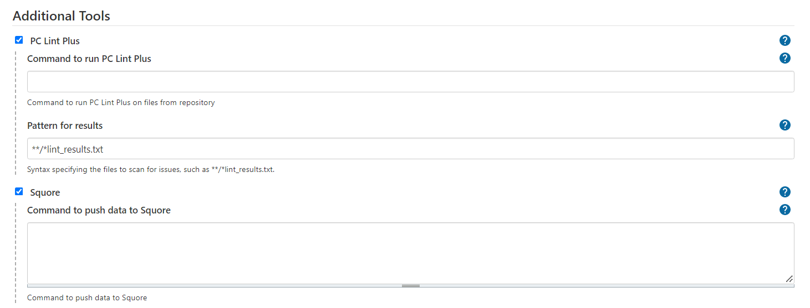

# Summary

This plugin allows the user to create Single and Pipeline Jobs to build and execute [VectorCAST](http://vector.com/vectorcast) Projects. Coverage is displayed using the [VectorCAST Coverage Plugin](https://wiki.jenkins.io/display/JENKINS/VectorCAST+Coverage+Plugin).

# Usage

This plugin adds a new top-level menu item to the Jenkins sidebar. Select the **VectorCAST** menu item to create a new VectorCAST Job.


## Job Types


There are two build/execute job types and one diagnostic job type.

-   **Single Job**
-   **Pipeline Job**
-   **Diagnostic Job**

### Single Job

Single Job creates a Single Jenkins Job to build/execute and (optionally) report on all environments in a VectorCAST Project.


### Pipeline Job

Pipeline Job creates a Pipeline Jenkins Job to build/execute and (optionally) report on all environments in a VectorCAST Project in parallel. A Pipeline script (Jenkinsfile) is created to run a build/execute job for each environment and an overall job to combine the results.

:warning: *Pipeline Jobs require VectorCAST 2018 as a minimum version and VectorCAST 2019SP3 to perform parallel execution on a single VectorCAST Project.*


There are two options for running tests:
- Using an SCM system (any that is supported by Jenkins).
    -   Jenkins will check out the source code and tests into the workspace for each Jenkins Job from the user's repository.
    -   The Pipeline Job will then combine the coverage and test results from all of the individual machines/nodes.
    -   The VectorCAST Project should be specified as relative to the root of the checkout.
    - There is now an option to use the main Pipeline Job's Workspace as a dedicated single checkout directory. This checkout directory must be available to all executors across all nodes either by having all executors running on the same computer or having the main Pipeline Job's Workspace on a shared network drive.
- Using an existing drive/directory for the VectorCAST Project.
    -   The VectorCAST Project should be specified as an absolute path that is available on all machines/nodes.
    -   Each job can optionally clean up the working directory which will have no effect on the VectorCAST Project since it is located elsewhere.
    -   The reports are generated into the workspace and archived as part of the Jenkins Job.
 
The user will be able to disable the use of Change Based Testing to perform a complete run of their VectorCAST Project. By default, Change Based Testing is enabled but this option can be disabled by unchecking the **Use Change Based Testing** box.

Users with Continuous Integration Licenses can access those licenses by checking the **Use Continuous Integration License** checkbox. If you do not have Continuous Integration Licenses, do not check this box as you will encounter licensing errors.

If the user wishes to call the Jenkins Job from another Pipeline Job, check the **Use Parameterize the Jenkinsfile** box. This will add parameters to the Pipeline Job that will be used by the VectorCAST Pipeline Job to locate the VectorCAST Project (**VCAST_PROJECT_DIR**) and force the VectorCAST Jobs to be executed on a specific node (**VCAST_FORCE_NODE_EXEC_NAME**) instead of using the compiler as a node label.

Calling the build command will return **Failed**, **Unstable**, or **Success** corresponding to the results of the VectorCAST Pipeline Job. To allow the main Pipeline Job to continue on error, the user can surround the build command without a _catchError_ block as demonstrated below.

```
catchError(buildResult: 'SUCCESS', stageResult: 'FAILURE', catchInterruptions : false ) {
   build job: 'UnitTestingProject_vcast_pipeline', parameters: [string(name: 'VCAST_PROJECT_DIR', value: 'C:\\UnitTesting\\Project'), string(name: 'VCAST_FORCE_NODE_EXEC_NAME', value: 'MyTestNode')]
}
```

Additionally, if a shared artifact directory is specified, jobs for the VectorCAST Project will be executed independently but have a central location for storing the build artifacts. This option can be used to accelerate testing by use of VectorCAST's Change Based Testing feature. 

For Pipeline Jobs, the plugin processes the build log to determine which tests have been skipped by VectorCAST's Change Based Testing feature. Any test cases that previously passed and were skipped on the current execution will be marked as skipped for JUnit and displayed in yellow on the test result trend chart and denoted as _Skipped_ in the test results list.


## Additional Tools

Other Vector tool integrations are supported by this plugin.  
-   **PC-lint Plus**
-   **Squore**
-   **TESTinsights**



- For **PC-lint Plus**, the user must provide the command or script that executes PC-lint Plus analysis. It is important that the following format properties are included to ensure the results file is readable by the Warnings-NG plugin:
```        
    -v // turn off verbosity
    -width(0) // don't insert line breaks (unlimited output width)
    -"format=%f(%l): %t %n: %m"
    -hs1 // The height of a message should be 1
```        
- For **Squore** analysis, the user must provide the Squore command found on the last page of the Squore project's configuration/build page. 
- For **TESTinsights**, if the user is using Git or Subversion for SCM, the plugin will attempt to have the SCM version linked to the TESTinsights project for team access and distributed change based testing. The user must provide the following:
    - TESTinsights URL - The URL to TESTinsights server and project (Use Copy Team Area Url).
    - TESTinsights Project - The Project Name in TESTinsights to push the results (leave blank to use the Jenkins Job Name).
    - TESTinsights Credential ID - The Credential ID from Jenkins for TESTinsights.
    - The proxy to push to TESTinsights server in the format **proxy.address:port** (optional)

## Controlling Where Jobs Run

When using a Pipeline Job, the sub jobs are created to run on specific node related to the compiler chosen for the environment. For example:


Make sure to set the labels on the relevant Jenkins nodes. Manage Jenkins -\> Manage Nodes -\> configure appropriate node and set the ‘Labels’ field. In this example the labels have been set to GNU\_Native\_5.1\_C and GNU\_Native\_4.8\_C


## Setup/Configuration

- VectorCAST must be installed and setup on each node.
- The environment variables **VECTORCAST\_DIR** and **VECTOR\_LICENSE** must be set.
- Jenkins must be installed and setup.
- **BUILD\_URL** must be defined (in Jenkins-\>Manage Jenkins-\>Configure System and define 'Jenkins URL' and save the settings).

## Known Issues

### VectorCAST Reports and Jenkins Content Security 

VectorCAST HTML reports for metrics were updated to use cascading style sheets (CSS) in the 2019 release and 2020 for top level project metrics. This was done to give users more flexibility in what and how metrics are displayed. To maintain single file HTML format, VectorCAST Reports used inline CSS. Inline CSS was disallowed under Jenkins more restrictive CSP.

"Jenkins 1.641 / Jenkins 1.625.3 introduce the `Content-Security-Policy` header to static files served by Jenkins (specifically, `DirectoryBrowserSupport`). This header is set to a very restrictive default set of permissions to protect Jenkins users from malicious HTML/JS files in workspaces, `/userContent`, or archived
artifacts."

The result of this combination incorrectly formatted the VectorCAST reports.

Numerous options are available to correct this:
- Use the Jenkins Resource Root URL (Manage Jenkins > Configure System)
- Reconfigure VectorCAST Jobs to use external CSS (**VCAST_RPTS_SELF_CONTAINED=FALSE**) combined with enabling anonymous reads from the Manage Jenkins > Configure Global Security > Authorization
- Reconfigure the Jenkins Content Security Policy
- Download the archives and view reports locally

For more information on the Jenkins CSP, please see [Configuring Content Security Policy](https://wiki.jenkins.io/display/JENKINS/Configuring+Content+Security+Policy)

For more information on VectorCAST Reports and Jenkins Content Security Policy, please see the article [VectorCAST Reports and Jenkins Content Security Policy](https://support.vector.com/kb?sys_kb_id=e54af267db6b6c904896115e68961902&id=kb_article_view&sysparm_rank=8&sysparm_tsqueryId=ba9d8f558707b858b9f233770cbb3543)

### JUnit publisher failing environment with no test cases

For non-pipeline jobs, JUnit publisher will fail any environments published without test results. If you have an environment with no test results, you will need to manually check the box "Do not fail the build on empty test results" in the Publish JUnit test result report configuration.

### Potential loss off requirements information

For customers using VectorCAST's requirements gateway, there's a potential for loss of requirements data when running test environments in parallel while using a shared requriments database.

## Change Log

### Version 0.74 (27 Sep 2022)
- findbugs-related warnings in the output from maven are fixed in the VectorCAST/Execution plugin v0.74
- The Jenkinsfile base has been restructured and commented for pipeline jobs
- Added catchError to additional tools stage
- Additional Java tests incorporated into the plugin build
- The VectorCAST icon has been updated to match the Jenkins design aesthetic
- Previously, errors indicated that calls cannot run in the Jenkins sandbox. VectorCAST/Execution v0.74 fixed errors caused by the updated version of Java required for the Jenkins plugin.

### Version 0.73 (22 Aug 2022)
- Fixed support for entering a Windows path for PC Lint Plus or Squore commands. 
- Fixed support for Continuous Integration Licenses.
- Fixed support for System Test Environments with Squore. 
- Fixed issue when TESTinsights project name is not given, it is named after the job.

### Version 0.72 (24 May 2022)
- Support was removed for the deprecated VectorCAST Multi-Jobs. Users should create VectorCAST Pipeline Jobs in place of VectorCAST Multi-Jobs.
- Previously, VectorCAST Jobs were executed on the built-in node by default. Now, when creating new VectorCAST Job, the user must provide the name of the node that the job should be executed on. Jenkins advises against running builds on the built-in node. See [Controller Isolation](https://www.jenkins.io/doc/book/security/controller-isolation/) for more information.
- A new stage was added to VectorCAST Pipeline jobs that runs the system tests in serial after running all unit tests. This prevents multiple instances of VectorCAST from modifying the same instrumented source files at the same time.
- Support for additional external tools was added for VectorCAST jobs. See the **Additional Tools** options on the job creation page.
  - PC-lint Plus
  - Squore
  - TESTinsights
- Options were reorganized on the VectorCAST Pipeline Job creation page.
- The VectorCAST Execution Plugin version is now displayed on the VectorCAST Jobs page.
- Previously, custom reports that used the **VCAST_MANAGE_PROJECT_DIRECTORY** environment variable would fail to generate. Now, the environment variable is set when the reports are generated.

### Version 0.71 (29 Sept 2021)
- Updated baseline pipeline script to reflect changes in the code coverage plugin
- Updated to skip CBT analysis on migrated system test projects
- Updated script to use import to detect DataAPI.

### Version 0.70 (2 Aug 2021)
- Updated scripts to use io.open for all opens
- Updated parse_traceback to display all tracebacks

### Version 0.69 (7 Jun 2021)
- Updated pipeline job to handle continuous integration licenses

### Version 0.68 (14 May 2021)
- New HTML reports match current Jenkins CSP
- Encoding read for GBK characters
- Bug fixes for compatibility issues with VectorCAST/2021
- Bug fix for counting run system test cases as skipped
- Handle uppercase VectorCAST Project .vcm extension

### Version 0.67 (30 March 2021)
- Add support for Python 3.9

### Version 0.66 (10 Feb 2021)
- Fixed bug caught by updated to Python 3
- Fixed command capture for processing later
- Changed side panel display of VectorCAST to not be shown when anonymous user is using Jenkins

### Version 0.65 (20 Jan 2021)
- Single jobs not displaying full report and rebuild report correctly in summary (VC2020)
- Capturing stdout for skipped analysis causing console output to be delayed
- Pipeline job fails unless user specific .vcm for VectorCAST Project
- Problem with CBT analysis when not using single checkout directory
- Using lowercase %workspace% causes single checkout directory error
- Updated managewait.py to overcome race condition causing script to hang on readline()
- Added skipped test analysis to Single Jobs
- Added detection of disabled environment to DataAPI generated results
- Added addition error detection

### Version 0.64 (17 Nov 2020)
- Skipped tests not detected for cover environments 
- Check for illegal characters in pipeline job names 
- Add Option to not use CBT in Jenkins pipeline plugin 
- VC2020 Manage reports have no formatting in Jenkins job summary 
- Remove xUnit reporting 
- Remove truncated output during the build 
- "Could not acquire a read lock on the project's vcm file" should raise an error, but it does not 
- Add option to active CI licenses 
- Regression Scripts with identical ending directories show testcase as skipped 
- Add option to make job parameterized for VectorCAST Project location and Force Node Execution rather than compiler 
- Update error thrown when user creates absolute path with SCM snippet 
- Need to add more error detection 
- Expand JUnit test case name display to include file.subprogram 
- Change reports to not use VCAST_RPTS_SELF_CONTAINED=FALSE 

### Version 0.63 (30 April 2020)

- Support Multi-Branch Pipelines
- Include plugin version in Pipeline Job Jenkins Script and console log
- Check for illegal characters in Pipeline Job names
- Update Single and Multi-Jobs to use same reporting as Pipeline Jobs
- Remove CombinedReport.html from previous Pipeline job build at beginning of new build
- Make aggregate coverage results consistent with VectorCAST Project aggregate coverage results
- Always use new VectorCAST report API for VectorCAST/2019 and later
- Fix potential file access race condition when generating xml
- Fix exception when building VectorCAST/Unit regression script environments
- Support for VectorCAST/vpython 3

### Version 0.62 (10 March 2020)

- Introduce pipeline job

### Version 0.61 (21 Dec 2019)

- Updated support for Jenkins Pipeline 
- Updated python scripts to work with VectorCAST 2019 SP3
- Added fix for Ada environments not building properly

### Version 0.60 (2 Oct 2019)

- Update support for Manage API and VCAST_RPTS_SELF_CONTAINED

### Version 0.59 (13 Sept 2019)

-   Update for VECTORCAST\_DIR rollback

### Version 0.58 (11 Sept 2019)

-   Update for different drive than workspace

### Version 0.57 (6 Sept 2019)

-   Updates for duplicate results in multijob

### Version 0.56 (5 Sept 2019)

-   Revert changes from 0.43 and 0.44 to remove need for
    VECTORCAST\_DIR. VECTORCAST\_DIR will need to be defined when
    running Jenkins for now.

### Version 0.55 (4 Sept 2019)

-   Add support for new VCAST\_RPTS\_SELF\_CONTAINED option added in
    VC19 SP2
-   Add support for using Manage API to generate XML reports if
    available
-   Correct variable expression on Linux platforms
-   Updated scripts to handle compound only in compound case

### Version 0.54 (28 Aug 2019)

-   Updates for F+FC coverage and updating database pathing

### Version 0.53 (20 Aug 2019)

-   Updates for changed to aggregate coverage report metrics heading
    change

### Version 0.52 (13 Aug 2019)

-   Additional debug logging

### Version 0.51 (8 Aug 2019)

-   Updates for scripts not handling Ada operator "+"

### Version 0.50 (11 Jul 2019)

-   Update exception handling when using DataAPI

### Version 0.49 (1 Jul 2019)

-   Updated to support VectorCAST 2019 SP1

### Version 0.48 (26 Jun 2019)

-   Update to get complete display name for C++ functions
-   Update to fix characters that need escaping in XML attributes

### Version 0.47 (18 Jun 2019)

-   Fix for disabled environments
-   Fix for printing non UTF-8 compliant failure code

### Version 0.46 (30 May 2019)

-   Updates for using external CSS/images

### Version 0.45 (10 May 2019)

-   Removed xUnit dependency and converted to JUnit.

### Version 0.44 (1 May 2019)

-   Added better legacy support for VectorCAST installations that do not
    have their executables on the system PATH

### Version 0.43 (26 Apr 2019)

-   Removed all uses of the environment variable VECTORCAST\_DIR. From
    now on it is assumed that VectorCAST executables are on the system
    PATH. Legacy support is still maintained for older versions of
    VectorCAST.
-   Additional cleaning up of old files

### Version 0.42 (25 Apr 2019)

-   Updates for corner cases, verbose out issue, and cleaning up
    previous build's files
-   Problem when function coverage enabled, but not function call
-   Function coverage format incorrect in XML causing plugin to throw an
    error
-   Added catch for additional licensing errors
-   Added catch for all (E) Line: errors in the console log

### Version 0.41 (12 Apr 2019)

-   Fix for function and basis path coverage when using VectorCAST 2019

### Version 0.40 (10 Apr 2019)

-   Update to fix auto job updates (where path to VectorCAST Project was
    being removed)

### Version 0.39 (19 Mar 2019)

-   Update to make the management report generate for a cover project

### Version 0.38 (23 Jan 2019)

-   Fix for spurious newline characters in report title in XML for
    Jenkins with VectorCAST 2019

### Version 0.37 (10 Jan 2019)

-   Corrected missing " that may affect running multi-job on Linux
-   Added support for generating reports using VectorCAST 2019

### Version 0.36 (27 Sept 2018)

-   Support overlapping version 17 VectorCAST Projects
-   Updates to support long directory paths in VectorCAST Project
    reporting

### Version 0.35 (15 May 2018)

-   Support newer versions of xUnit plugin

### Version 0.34 (10 May 2018)

-   Support MultiJob plugin up to 0.29 and later, 0.30 onwards

### Version 0.33 (18 Jan 2018)

-   Don't create intermediate CSV file for bad test case management
    report

-   Raise post-groovy alert for bad test case management report

### Version 0.32 (15 Jan 2018)

-   Improve support for unit without coverage, avoiding corrupt xml
    files

### Version 0.31 (13 Dec 2017)

-   Removed spurious " in Linux single job
-   Corrected link from xUnit graph to report

### Version 0.30 (5 Dec 2017)

-   Correct regression with report naming for archived artifacts with
    shorter names
-   Added environment variable (VCAST\_VC\_SCRIPTS) to provide optional
    source of vc\_scripts

### Version 0.29 (27 Nov 2017)

-   Improve support for long VectorCAST Project names, environment names and
    compiler names

### Version 0.28 (2 Nov 2017)

-   Correct regression with windows variable names being used in Unix
    script

### Version 0.27 (2 Nov 2017)

-   Correct regression with missing space in commands for single job

### Version 0.26 (1 Nov 2017

-   Option to set the name of the single job or multi-job (name is
    pre-pended to sub-job in the case of multi-jobs)
-   Option to configure (at creation/update time) the node to run the
    single job or top-level multi-job on
-   Allow license retries for single jobs
-   Update summary/detailed text written by the groovy scripts

### Version 0.25 (26 Oct 2017)

-   Update to retry functionality to support jobs created with earlier
    plugin versions

### Version 0.24 (25 Oct 2017)

-   Update to store and use job details when auto-updating
-   Added (optional) ability to retry a command if it fails due to
    unavailable license

### Version 0.23 (17 Oct 2017)

-   Added a job that can be used to update an existing multi-job

### Version 0.22 (26 Sept 2017

-   Added support for new version of VectorCAST Manage that uses 2
    levels instead of 4

### Version 0.21 (24 Jul 2017)

-   Improved groovy script to mark failing builds as failed rather than
    unstable

### Version 0.20 (18 Jul 2017)

-   Allow conversion script to accept report that has a missing or
    incomplete Function Coverage column

### Version 0.19 (23 Jun 2017)

-   Added --force option to use of --release-locks
-   Added option to use either HTML or TEXT format for the build
    description

### Version 0.18 (20 Mar 2017)

-   Add execution report link to all test cases
-   Added update to pulling in both the full report and incremental
    build report into the job build description
-   Added update to pulling in both the full report and incremental
    build report into the job build description

### Version 0.17 (17 Mar 2017)

-   Always display the VectorCAST menu and leave permission
    checking/reporting to Jenkins

### Version 0.16 (15 Mar 2017)

-   Corrected processing checking if BUILD\_URL has been set

### Version 0.15 (2 Jan 2017)

-   Corrected processing to support function and function call coverage

### Version 0.14 (16 Dec 2016)

-   Corrected typos in Diagnostics job and pattern for files to copy

### Version 0.13 (14 Dec 2016)

-   Add support for spaces in paths

### Version 0.12 (9 Dec 2016)

-   Add support to keep or clean the working directory

### Version 0.11 (7 Dec 2016)

-   Support added for multi-job with SCM and for calculating correctly
    aggregated coverage for the top-level display in the VectorCAST
    coverage plugin

### Version 0.10 (23 Nov 2016)

-   Initial release (no support for using SCM with multi-job)
