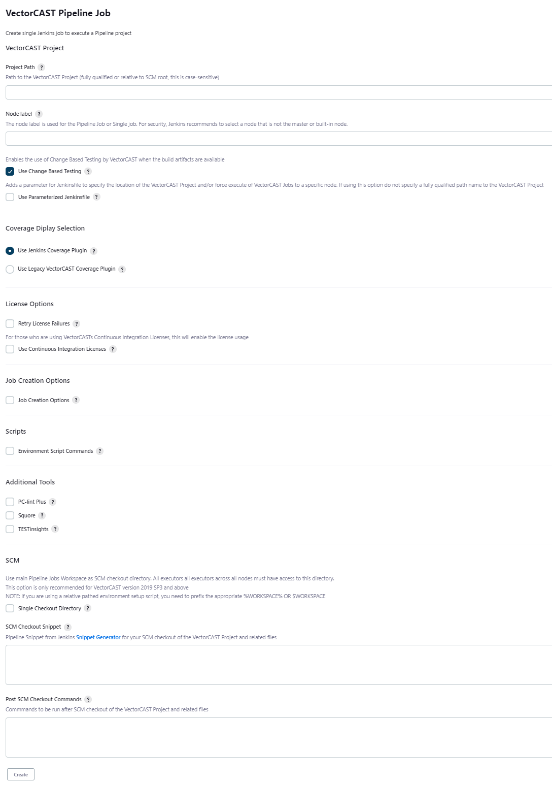
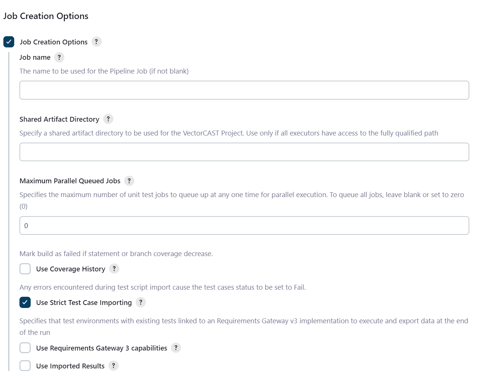

[](https://github.com/jenkinsci/vectorcast-execution-plugin/actions/workflows/coverage.yml)
[](https://github.com/jenkinsci/vectorcast-execution-plugin/actions/workflows/codeql.yml)
[](https://github.com/jenkinsci/vectorcast-execution-plugin/actions/workflows/ci.yml)

# Table of Contents

<!-- TOC -->
* [Table of Contents](#table-of-contents)
* [Summary](#summary)
  * [Setup/Configuration](#setupconfiguration)
* [Usage](#usage)
  * [Job Types](#job-types)
    * [Single Job](#single-job)
    * [Pipeline Job](#pipeline-job)
    * [Coverage Display Selection](#coverage-display-selection)
      * [Information about Jenkins Coverage Plugin](#information-about-jenkins-coverage-plugin)
      * [Advanced Settings for Jenkins Coverage Plugin](#advanced-settings-for-jenkins-coverage-plugin)
      * [Information about legacy VectorCAST Coverage Plugin](#information-about-legacy-vectorcast-coverage-plugin)
    * [Job Creation Options](#job-creation-options)
      * [Job Name](#job-name-)
      * [Shared Artifact Directory](#shared-artifact-directory)
      * [Maximum Parallel Queued Jobs](#maximum-parallel-queued-jobs)
      * [Use Coverage History](#use-coverage-history)
      * [Use Strict Test Case Importing](#use-strict-test-case-importing)
      * [Use Requirements Gateway 3 capabilities](#use-requirements-gateway-3-capabilities)
      * [Use Imported Results](#use-imported-results)
      * [Using Local Imported Results](#using-local-imported-results)
      * [Using External Imported Results](#using-external-imported-results)
    * [Additional Tools](#additional-tools)
      * [PC-lint Plus](#pc-lint-plus)
      * [Squore](#squore)
      * [TESTinsights](#testinsights)
    * [Controlling Where Jobs Run](#controlling-where-jobs-run)
  * [Build Summary](#build-summary)
  * [Test Results](#test-results)
    * [Passing Test Case](#passing-test-case)
    * [Failing Test Case](#failing-test-case)
  * [Known Issues](#known-issues)
    * [VectorCAST Reports and Jenkins Content Security](#vectorcast-reports-and-jenkins-content-security-)
    * [JUnit publisher failing environment with no test cases](#junit-publisher-failing-environment-with-no-test-cases)
    * [Potential loss of requirements information](#potential-loss-of-requirements-information)
    * [Test and code coverage reporting with Imported Results](#test-and-code-coverage-reporting-with-imported-results)
    * [Using Change Based Testing Imported Results with QA Project](#using-change-based-testing-imported-results-with-qa-project)
    * [Disabled environments may add coverage metrics](#disabled-environments-may-add-coverage-metrics)
  * [Change Log](#change-log)
<!-- TOC -->

# Summary

This plugin allows the user to create Single and Pipeline Jobs to build and execute [VectorCAST](http://vector.com/vectorcast) Projects. Test results are display with the [Jenkins JUnit Plugin](https://plugins.jenkins.io/junit/) and code coverage is displayed using either 
- [Jenkins Coverage Plugin](https://plugins.jenkins.io/coverage) 
- [VectorCAST Coverage Plugin](https://wiki.jenkins.io/display/JENKINS/VectorCAST+Coverage+Plugin).

## Setup/Configuration

- VectorCAST must be installed and setup on each node.
- The environment variables **VECTORCAST\_DIR** and **VECTOR\_LICENSE** must be set.
- Jenkins must be installed and setup.
- **BUILD\_URL** must be defined (in Jenkins-\>Manage Jenkins-\>Configure System and define 'Jenkins URL' and save the settings).

# Usage

This plugin adds a new top-level menu item to the Jenkins sidebar. Select the **VectorCAST** menu item to create a new VectorCAST Job.


## Job Types


There are two build/execute job types and one diagnostic job type.

-   **Single Job**
-   **Pipeline Job**
-   **Diagnostic Job**

### Single Job

Single Job creates a Single Jenkins Job to build/execute and (optionally) report on all environments in a VectorCAST Project.


### Pipeline Job

Pipeline Job creates a Pipeline Jenkins Job to build/execute and (optionally) report on all environments in a VectorCAST Project in parallel. A Pipeline script (Jenkinsfile) is created to run a build/execute job for each environment and an overall job to combine the results.

:warning: *Pipeline Jobs require VectorCAST 2018 as a minimum version and VectorCAST 2019SP3 to perform parallel execution on a single VectorCAST Project.*



There are two options for running tests:
- Using an SCM system (any that is supported by Jenkins).
    - Jenkins will check out the source code and tests into the workspace for each Jenkins Job from the user's repository.
    - The Pipeline Job will then combine the coverage and test results from all of the individual machines/nodes.
    - The VectorCAST Project should be specified as relative to the root of the checkout.
    - There is now an option to use the main Pipeline Job's Workspace as a dedicated single checkout directory. This checkout directory must be available to all executors across all nodes either by having all executors running on the same computer or having the main Pipeline Job's Workspace on a shared network drive.
    - Using an existing drive/directory for the VectorCAST Project.
    - The VectorCAST Project should be specified as an absolute path that is available on all machines/nodes.
    - Each job can optionally clean up the working directory which will have no effect on the VectorCAST Project since it is located elsewhere.
    - The reports are generated into the workspace and archived as part of the Jenkins Job.
 
The user will be able to disable the use of Change Based Testing to perform a complete run of their VectorCAST Project. By default, Change Based Testing is enabled but this option can be disabled by unchecking the **Use Change Based Testing** box.

Users with Continuous Integration Licenses can access those licenses by checking the **Use Continuous Integration License** checkbox. If you do not have Continuous Integration Licenses, do not check this box as you will encounter licensing errors.

If the user wishes to call the Jenkins Job from another Pipeline Job, check the **Use Parameterize the Jenkinsfile** box. This will add parameters to the Pipeline Job that will be used by the VectorCAST Pipeline Job to locate an external VectorCAST Project (**VCAST_PROJECT_DIR**) and force the VectorCAST Jobs to be executed on a specific node (**VCAST_FORCE_NODE_EXEC_NAME**) instead of using the compiler as a node label.

If addition processing is required to a repository after checkout, the user can add **Post SCM Checkout Commands**.  These commands would be native to a shell or batch file depending on which platform the jobs is running on.

Calling the build command will return **Failed**, **Unstable**, or **Success** corresponding to the results of the VectorCAST Pipeline Job. To allow the main Pipeline Job to continue on error, the user can surround the build command without a _catchError_ block as demonstrated below.

```
catchError(buildResult: 'SUCCESS', stageResult: 'FAILURE', catchInterruptions : false ) {
   build job: 'UnitTestingProject_vcast_pipeline', parameters: [string(name: 'VCAST_PROJECT_DIR', value: 'C:\\UnitTesting\\Project'), string(name: 'VCAST_FORCE_NODE_EXEC_NAME', value: 'MyTestNode')]
}
```

For Pipeline Jobs, the plugin processes the build log to determine which tests have been skipped by VectorCAST's Change Based Testing feature. Any test cases that previously passed and were skipped on the current execution will be marked as skipped for JUnit and displayed in yellow on the test result trend chart and denoted as _Skipped_ in the test results list.


### Coverage Display Selection

The VectorCAST Execution Plugin is transitioning from using the older VectorCAST Coverage Plugin (Legacy Plugin) to the Jenkins Coverage Plugin.  Until that transition is complete, the use is offered a choice to decide which coverage display to use.


#### Information about Jenkins Coverage Plugin
The [Jenkins Coverage Plugin](https://plugins.jenkins.io/coverage) publishes a report of the code and mutation coverage in your build, so you can navigate to a summary report from the main build page. Additionally, the plugin gathers several metrics (lines of code, cyclomatic complexity, number of tests per class) and visualizes these results along with the coverage information.

By using the Jenkins Coverage Plugin, users can also dive into the details:
- Tree charts that show the distribution of the metrics by type (line, branch, complexity, tests, etc.)
- Tabular listing of all files with their coverage, complexity and number of tests
- Source code of the files with the coverage highlighted
- Trend charts of the coverage over time


#### Advanced Settings for Jenkins Coverage Plugin

Two classes of settings can be accessed in the Jenkins Coverage Plugin
- Quality Gates
- Advanced Options

To access the advanced settings:

- Pipeline Jobs - You can access the Snippet Generator and use the configure a new pipeline snippet. Once you have the step configured, you can use the Generate Pipeline Script button, copy that snippet and replace the existing Coverage snippet in the job configuration. For more information regarding the advanced settings of the Jenkins Coverage Plugin, please refer to the documentation
Settings to process VectorCAST Coverage Results:
    - Sample Step: recordCoverage: Record code coverage results
    - Code Coverage Tool > Coverage Parser: VectorCAST Coverage Results
    - Code Coverage Tool > Report File Pattern: xml_data/cobertura/coverage_results*.html
- Single Job - The setup for the Single Job will be one of the post-build steps.

#### Information about legacy VectorCAST Coverage Plugin
The [VectorCAST Coverage Plugin](https://plugins.jenkins.io/vectorcast-coverage/) Processes code coverage metrics from for VectorCAST Projects
This legacy plugin allows you to capture code coverage reports from VectorCAST Projects. Jenkins will generate the trend report of coverage. This plugin is used automatically with the VectorCAST Execution Plugin
Coverage information from tests runs that has been converted to XML files is read and displayed by this plugin. 

It shows coverage trends and allows drilling down to more detailed coverage information:

- Tree charts that show the distribution of the metrics by type (line, branch, MC/DC Pairs, Function Coverage, etc.)
- Tabular listing of all environments/files with their coverage and complexity
- Trend charts of the coverage over time

:warning: Legacy Plugin Info
This is a legacy plugin and will have no futher development beyond bug fixes and security updates


### Job Creation Options

The user can customize additional parameters for job creation by selecting the **Job Creation Options**:



#### Job Name 
Use the Job Name setting for changing the created pipeline job name.  Default is *VectorCASTProjectName*\_vcast\_pipeline

#### Shared Artifact Directory
The Shared Artifact Directory (Pipeline Job Only) option allows VectorCAST Project's build artifacts to be stored in a different location from the default *VectorCASTProjectName*/build.  If stored in a location that can be maintained between builds, VectorCAST's Change Based Testing can accelerate testing

#### Maximum Parallel Queued Jobs
Maximum Parallel Queued Jobs (Pipeline Job Only) allows the job to specify the maximum number of unit test jobs to queue up at any one time for parallel execution. To queue all jobs, leave blank or set to zero (0). The use case for this option would be if you don't want to queue the Jenkins server with all VectorCAST environment build/execute jobs; thus, allowing other jobs to queue up as well.

#### Use Coverage History
Use Coverage History marks build as failed if statement or branch coverage decrease by comparing the previous non-failing build's statement and branch coverage to the current build's statement and branch coverage. If either of the coverages have decreased the job will be marked as failed.

_:information_source: When using the Jenkins Coverage Plugin, this will be completed by adding a quality gate for any drop in Statement or Branch coverages.  It will be denoted in the Coverage Report section of the Build Status_


#### Use Strict Test Case Importing
Use Strict Test Case Importing allows the job to mark individual test cases as failures if errors encountered during test script import.  This option enables strict testcase importing for the VectorCAST Project.  This option give a more reliable metrics for pass/fail test cases as without strict test case import, bad test cases are just ignored.  The default is enabled.

#### Use Requirements Gateway 3 capabilities
This option allows test environments with existing tests linked to an Requirements Gateway v3 implementation, that uses seperate .json files, to execute in parallel and export data at the end of the run.

#### Use Imported Results
Use Imported Results allows jobs to previous test results as input for the current job execution phase.  This option allows VectorCAST Change Based Testing to have a known result to work from.  This option works in conjunction with _Use Change Based Testing_. The user can selected between internal imported results or external result files


#### Using Local Imported Results
When using imported results and the Use Local Imported Results option, the job will export results from the current build and save that result file as an job artifact. The next build will pull the result archive from the last SUCCESS or UNSTABLE build and use change based testing against that result baseline. If existing build artifacts exist, the combined results will be used for change based testing.

#### Using External Imported Results
When using imported results and the Use External Result File option, the job will use an external results from the a specified location to use as a baseline for the the current job. If existing build artifacts exist, the combined results will be used for change based testing.  The user will need to specify an external result filename (.vcr) in the External Result Filename option.  This file would be typically stored in the repository.  This external result file could be updated by a main branch or periodic build to establish a current baseline.

### Additional Tools

Other Vector tool integrations are supported by this plugin.  
-   PC-lint Plus
-   Squore
-   TESTinsights


#### PC-lint Plus
For [PC-lint Plus](https://pclintplus.com/), the user must provide the command or script that executes PC-lint Plus analysis. It is important that the following format properties are included to ensure the results file is readable by the Warnings-NG plugin:
```        
    -v // turn off verbosity
    -width(0) // don't insert line breaks (unlimited output width)
    -"format=%f(%l): %t %n: %m"
    -hs1 // The height of a message should be 1
```
#### Squore
For [Squore](https://www.vector.com/int/en/products/products-a-z/software/squore/) analysis, the user must provide the Squore command found on the last page of the Squore project's configuration/build page. 

#### TESTinsights
For [TESTinsights](https://www.vector.com/int/en/products/products-a-z/software/vectorcast/vectorcast-testinsights), if the user is using Git or Subversion for SCM, the plugin will attempt to have the SCM version linked to the TESTinsights project for team access and distributed change based testing. The user must provide the following:
    - TESTinsights URL - The URL to TESTinsights server and project (Use Copy Team Area Url).
    - TESTinsights Project - The Project Name in TESTinsights to push the results (leave blank to use the Jenkins Job Name).
    - TESTinsights Credential ID - The Credential ID from Jenkins for TESTinsights.
    - The proxy to push to TESTinsights server in the format **proxy.address:port** (optional)

### Controlling Where Jobs Run

When using a Pipeline Job, the sub jobs are created to run on specific node related to the compiler chosen for the environment. For example:


Make sure to set the labels on the relevant Jenkins nodes. Manage Jenkins -\> Manage Nodes -\> configure appropriate node and set the ‘Labels’ field. In this example the labels have been set to GNU\_Native\_5.1\_C and GNU\_Native\_4.8\_C


## Build Summary

The build summary show the following sections:

- General Jenkins Information including
    - Any errors or warnings that occurred during the build will be show beneath the build number and date  
    - Build Artifacts including HTML reports, XML reports, pass/fail counts in text file, complete build log
    - [Test Results](#test-results) section that can expand to show you test results
- Code Coverage Differences (Only available when using the VectorCAST Code Coverage Plugin)
- VectorCAST Project Incremental Rebuild Report (Only available when using Change Based Testing)
- VectorCAST Project Full Status Report
- VectorCAST Project Metrics Report


## Test Results

Test results will show the user which test cases passed, failed, or were skipped by Change Based Testing.

By selecting individual cases, you can see the execution reports for that test case.  This can give the user insight into why a test case failed.

### Passing Test Case


### Failing Test Case


## Known Issues

### VectorCAST Reports and Jenkins Content Security 

VectorCAST HTML reports for metrics were updated to use cascading style sheets (CSS) in the 2019 release and 2020 for top level project metrics. This was done to give users more flexibility in what and how metrics are displayed. To maintain single file HTML format, VectorCAST Reports used inline CSS. Inline CSS was disallowed under Jenkins more restrictive CSP.

"Jenkins 1.641 / Jenkins 1.625.3 introduce the `Content-Security-Policy` header to static files served by Jenkins (specifically, `DirectoryBrowserSupport`). This header is set to a very restrictive default set of permissions to protect Jenkins users from malicious HTML/JS files in workspaces, `/userContent`, or archived
artifacts."

The result of this combination incorrectly formatted the VectorCAST reports.

Numerous options are available to correct this:
- Use the Jenkins Resource Root URL (Manage Jenkins > Configure System)
- Reconfigure VectorCAST Jobs to use external CSS (**VCAST_RPTS_SELF_CONTAINED=FALSE**) combined with enabling anonymous reads from the Manage Jenkins > Configure Global Security > Authorization
- Reconfigure the Jenkins Content Security Policy
- Download the archives and view reports locally

For more information on the Jenkins CSP, please see [Configuring Content Security Policy](https://wiki.jenkins.io/display/JENKINS/Configuring+Content+Security+Policy)

For more information on VectorCAST Reports and Jenkins Content Security Policy, please see the article [VectorCAST Reports and Jenkins Content Security Policy](https://support.vector.com/kb?sys_kb_id=e54af267db6b6c904896115e68961902&id=kb_article_view&sysparm_rank=8&sysparm_tsqueryId=ba9d8f558707b858b9f233770cbb3543)

### JUnit publisher failing environment with no test cases

For non-pipeline jobs, JUnit publisher will fail any environments published without test results. If you have an environment with no test results, you will need to manually check the box "Do not fail the build on empty test results" in the Publish JUnit test result report configuration.

### Potential loss of requirements information

For customers using VectorCAST's requirements gateway, there's a potential for loss of requirements data when running test environments in parallel while using a shared requriments database.

### Test and code coverage reporting with Imported Results

For environments that use imported results with versions of VectorCAST before 2020, reporting of test results and code coverage will not properly generate because of the lack of required build information.

### Using Change Based Testing Imported Results with QA Project

VectorCAST/QA projects cannot use imported results for change based testing

### Disabled environments may add coverage metrics

In rare cases, VectorCAST projects will have disabled environment with results stored before they were disabled.  In cases where the disabled environments share source file with enabled environments, this may lead addition coverage metrics.  It is recommended to clean the 
environment before disabling.  This takes into account enviornments that are directly disabled or disabled at the Compiler or TestSuite Nodes.  To avoid this, please clean environments before disabling them

## Change Log

### Version 0.78 (10 Sep 2024)
- Moved to minimum Jenkins version: 2.452.1
- Adding in following capabilities
    - Extended Cobertura format output for use with [Jenkins Coverage Plugin](https://github.com/jenkinsci/coverage-plugin)
    - Unit Test Data format output in SonarQube format 
    - Adding capability to generate an index.html for all .html reports
- Refactored New Job code to reduce duplication
- Moved to Jenkins 2.440 and Java 11
- Added BETA support for RGW3
- Removed VectorCAST Project Environment report
- Removed extra options for Update job as the plugin doesn't support Update job
- Added a check for bad option combination

### Version 0.77 (21 Aug 2024)
- Updated for findbugs to spotbugs
- Fixed changed based testing analysis for compound tests being shown as Skipped
- Fixed getjobs.py script to account for disabled compiler/testsuite nodes
- Added option for adding strict test importing
- Added option for using imported results for change based Testing
    - Local results will be saved as a Jenkins Build artifact
    - External results will be used from the repository
    - Added support for DataAPI VCProjectApi for reporting imported results
- Bump json from 20220320 to 20230227
- Added maximum number of jobs to be queued so that server won't get flood with jobs and stall other Jenkins jobs
- Removed Squore script as customer should use script from their Squore installation.
- Fixed copy_build_dir.py ability to handle relative paths in the database.
- Removed duplicate code/variables in NewPipeline.java.
- Switched from CustomReport.report_from_api to api.report to solve corner case
- Fixed remote copy of VCAST_VC_SCRIPTS

### Version 0.76 (19 Jan 2023)
- Added support in VectorCAST version 2023 Projects for environments that are not in a group

### Version 0.75 (23 Dec 2022)
- Decoupled the two parameters used for parameterized pipeline
- Fixed skipped test analysis issue for overloaded C++ methods
- Fixed error in pipeline syntax "continue" changed to "return" for each loop
- Fixed single job error when not using CBT for missing incremental build rebuild report
- Added option to have pipeline job be marked as failed if statement or branch coverage decreases
- Added post-SCM step to run commands after SCM checkout before the project build/execute
- Fixed error identifying unbuilt migrated system test projects

### Version 0.74 (27 Sep 2022)
- findbugs-related warnings in the output from maven are fixed in the VectorCAST/Execution plugin v0.74
- The Jenkinsfile base has been restructured and commented for pipeline jobs
- Added catchError to additional tools stage
- Additional Java tests incorporated into the plugin build
- The VectorCAST icon has been updated to match the Jenkins design aesthetic
- Previously, errors indicated that calls cannot run in the Jenkins sandbox. VectorCAST/Execution v0.74 fixed errors caused by the updated version of Java required for the Jenkins plugin.

### Version 0.73 (22 Aug 2022)
- Fixed support for entering a Windows path for PC Lint Plus or Squore commands. 
- Fixed support for Continuous Integration Licenses.
- Fixed support for System Test Environments with Squore. 
- Fixed issue when TESTinsights project name is not given, it is named after the job.

### Version 0.72 (24 May 2022)
- Support was removed for the deprecated VectorCAST Multi-Jobs. Users should create VectorCAST Pipeline Jobs in place of VectorCAST Multi-Jobs.
- Previously, VectorCAST Jobs were executed on the built-in node by default. Now, when creating new VectorCAST Job, the user must provide the name of the node that the job should be executed on. Jenkins advises against running builds on the built-in node. See [Controller Isolation](https://www.jenkins.io/doc/book/security/controller-isolation/) for more information.
- A new stage was added to VectorCAST Pipeline jobs that runs the system tests in serial after running all unit tests. This prevents multiple instances of VectorCAST from modifying the same instrumented source files at the same time.
- Support for additional external tools was added for VectorCAST jobs. See the **Additional Tools** options on the job creation page.
  - PC-lint Plus
  - Squore
  - TESTinsights
- Options were reorganized on the VectorCAST Pipeline Job creation page.
- The VectorCAST Execution Plugin version is now displayed on the VectorCAST Jobs page.
- Previously, custom reports that used the **VCAST_MANAGE_PROJECT_DIRECTORY** environment variable would fail to generate. Now, the environment variable is set when the reports are generated.

### Version 0.71 (29 Sept 2021)
- Updated baseline pipeline script to reflect changes in the code coverage plugin
- Updated to skip CBT analysis on migrated system test projects
- Updated script to use import to detect DataAPI.

### Version 0.70 (2 Aug 2021)
- Updated scripts to use io.open for all opens
- Updated parse_traceback to display all tracebacks

### Version 0.69 (7 Jun 2021)
- Updated pipeline job to handle continuous integration licenses

### Version 0.68 (14 May 2021)
- New HTML reports match current Jenkins CSP
- Encoding read for GBK characters
- Bug fixes for compatibility issues with VectorCAST/2021
- Bug fix for counting run system test cases as skipped
- Handle uppercase VectorCAST Project .vcm extension

### Version 0.67 (30 March 2021)
- Add support for Python 3.9

### Version 0.66 (10 Feb 2021)
- Fixed bug caught by updated to Python 3
- Fixed command capture for processing later
- Changed side panel display of VectorCAST to not be shown when anonymous user is using Jenkins

### Version 0.65 (20 Jan 2021)
- Single jobs not displaying full report and rebuild report correctly in summary (VC2020)
- Capturing stdout for skipped analysis causing console output to be delayed
- Pipeline job fails unless user specific .vcm for VectorCAST Project
- Problem with CBT analysis when not using single checkout directory
- Using lowercase %workspace% causes single checkout directory error
- Updated managewait.py to overcome race condition causing script to hang on readline()
- Added skipped test analysis to Single Jobs
- Added detection of disabled environment to DataAPI generated results
- Added addition error detection

### Version 0.64 (17 Nov 2020)
- Skipped tests not detected for cover environments 
- Check for illegal characters in pipeline job names 
- Add Option to not use CBT in Jenkins pipeline plugin 
- VC2020 Manage reports have no formatting in Jenkins job summary 
- Remove xUnit reporting 
- Remove truncated output during the build 
- "Could not acquire a read lock on the project's vcm file" should raise an error, but it does not 
- Add option to active CI licenses 
- Regression Scripts with identical ending directories show testcase as skipped 
- Add option to make job parameterized for VectorCAST Project location and Force Node Execution rather than compiler 
- Update error thrown when user creates absolute path with SCM snippet 
- Need to add more error detection 
- Expand JUnit test case name display to include file.subprogram 
- Change reports to not use VCAST_RPTS_SELF_CONTAINED=FALSE 

### Version 0.63 (30 April 2020)

- Support Multi-Branch Pipelines
- Include plugin version in Pipeline Job Jenkins Script and console log
- Check for illegal characters in Pipeline Job names
- Update Single and Multi-Jobs to use same reporting as Pipeline Jobs
- Remove CombinedReport.html from previous Pipeline job build at beginning of new build
- Make aggregate coverage results consistent with VectorCAST Project aggregate coverage results
- Always use new VectorCAST report API for VectorCAST/2019 and later
- Fix potential file access race condition when generating xml
- Fix exception when building VectorCAST/Unit regression script environments
- Support for VectorCAST/vpython 3

### Version 0.62 (10 March 2020)

- Introduce pipeline job

### Version 0.61 (21 Dec 2019)

- Updated support for Jenkins Pipeline 
- Updated python scripts to work with VectorCAST 2019 SP3
- Added fix for Ada environments not building properly

### Version 0.60 (2 Oct 2019)

- Update support for Manage API and VCAST_RPTS_SELF_CONTAINED

### Version 0.59 (13 Sept 2019)

-   Update for VECTORCAST\_DIR rollback

### Version 0.58 (11 Sept 2019)

-   Update for different drive than workspace

### Version 0.57 (6 Sept 2019)

-   Updates for duplicate results in multijob

### Version 0.56 (5 Sept 2019)

-   Revert changes from 0.43 and 0.44 to remove need for
    VECTORCAST\_DIR. VECTORCAST\_DIR will need to be defined when
    running Jenkins for now.

### Version 0.55 (4 Sept 2019)

-   Add support for new VCAST\_RPTS\_SELF\_CONTAINED option added in
    VC19 SP2
-   Add support for using Manage API to generate XML reports if
    available
-   Correct variable expression on Linux platforms
-   Updated scripts to handle compound only in compound case

### Version 0.54 (28 Aug 2019)

-   Updates for F+FC coverage and updating database pathing

### Version 0.53 (20 Aug 2019)

-   Updates for changed to aggregate coverage report metrics heading
    change

### Version 0.52 (13 Aug 2019)

-   Additional debug logging

### Version 0.51 (8 Aug 2019)

-   Updates for scripts not handling Ada operator "+"

### Version 0.50 (11 Jul 2019)

-   Update exception handling when using DataAPI

### Version 0.49 (1 Jul 2019)

-   Updated to support VectorCAST 2019 SP1

### Version 0.48 (26 Jun 2019)

-   Update to get complete display name for C++ functions
-   Update to fix characters that need escaping in XML attributes

### Version 0.47 (18 Jun 2019)

-   Fix for disabled environments
-   Fix for printing non UTF-8 compliant failure code

### Version 0.46 (30 May 2019)

-   Updates for using external CSS/images

### Version 0.45 (10 May 2019)

-   Removed xUnit dependency and converted to JUnit.

### Version 0.44 (1 May 2019)

-   Added better legacy support for VectorCAST installations that do not
    have their executables on the system PATH

### Version 0.43 (26 Apr 2019)

-   Removed all uses of the environment variable VECTORCAST\_DIR. From
    now on it is assumed that VectorCAST executables are on the system
    PATH. Legacy support is still maintained for older versions of
    VectorCAST.
-   Additional cleaning up of old files

### Version 0.42 (25 Apr 2019)

-   Updates for corner cases, verbose out issue, and cleaning up
    previous build's files
-   Problem when function coverage enabled, but not function call
-   Function coverage format incorrect in XML causing plugin to throw an
    error
-   Added catch for additional licensing errors
-   Added catch for all (E) Line: errors in the console log

### Version 0.41 (12 Apr 2019)

-   Fix for function and basis path coverage when using VectorCAST 2019

### Version 0.40 (10 Apr 2019)

-   Update to fix auto job updates (where path to VectorCAST Project was
    being removed)

### Version 0.39 (19 Mar 2019)

-   Update to make the management report generate for a cover project

### Version 0.38 (23 Jan 2019)

-   Fix for spurious newline characters in report title in XML for
    Jenkins with VectorCAST 2019

### Version 0.37 (10 Jan 2019)

-   Corrected missing " that may affect running multi-job on Linux
-   Added support for generating reports using VectorCAST 2019

### Version 0.36 (27 Sept 2018)

-   Support overlapping version 17 VectorCAST Projects
-   Updates to support long directory paths in VectorCAST Project
    reporting

### Version 0.35 (15 May 2018)

-   Support newer versions of xUnit plugin

### Version 0.34 (10 May 2018)

-   Support MultiJob plugin up to 0.29 and later, 0.30 onwards

### Version 0.33 (18 Jan 2018)

-   Don't create intermediate CSV file for bad test case management
    report

-   Raise post-groovy alert for bad test case management report

### Version 0.32 (15 Jan 2018)

-   Improve support for unit without coverage, avoiding corrupt xml
    files

### Version 0.31 (13 Dec 2017)

-   Removed spurious " in Linux single job
-   Corrected link from xUnit graph to report

### Version 0.30 (5 Dec 2017)

-   Correct regression with report naming for archived artifacts with
    shorter names
-   Added environment variable (VCAST\_VC\_SCRIPTS) to provide optional
    source of vc\_scripts

### Version 0.29 (27 Nov 2017)

-   Improve support for long VectorCAST Project names, environment names and
    compiler names

### Version 0.28 (2 Nov 2017)

-   Correct regression with windows variable names being used in Unix
    script

### Version 0.27 (2 Nov 2017)

-   Correct regression with missing space in commands for single job

### Version 0.26 (1 Nov 2017

-   Option to set the name of the single job or multi-job (name is
    pre-pended to sub-job in the case of multi-jobs)
-   Option to configure (at creation/update time) the node to run the
    single job or top-level multi-job on
-   Allow license retries for single jobs
-   Update summary/detailed text written by the groovy scripts

### Version 0.25 (26 Oct 2017)

-   Update to retry functionality to support jobs created with earlier
    plugin versions

### Version 0.24 (25 Oct 2017)

-   Update to store and use job details when auto-updating
-   Added (optional) ability to retry a command if it fails due to
    unavailable license

### Version 0.23 (17 Oct 2017)

-   Added a job that can be used to update an existing multi-job

### Version 0.22 (26 Sept 2017

-   Added support for new version of VectorCAST Manage that uses 2
    levels instead of 4

### Version 0.21 (24 Jul 2017)

-   Improved groovy script to mark failing builds as failed rather than
    unstable

### Version 0.20 (18 Jul 2017)

-   Allow conversion script to accept report that has a missing or
    incomplete Function Coverage column

### Version 0.19 (23 Jun 2017)

-   Added --force option to use of --release-locks
-   Added option to use either HTML or TEXT format for the build
    description

### Version 0.18 (20 Mar 2017)

-   Add execution report link to all test cases
-   Added update to pulling in both the full report and incremental
    build report into the job build description
-   Added update to pulling in both the full report and incremental
    build report into the job build description

### Version 0.17 (17 Mar 2017)

-   Always display the VectorCAST menu and leave permission
    checking/reporting to Jenkins

### Version 0.16 (15 Mar 2017)

-   Corrected processing checking if BUILD\_URL has been set

### Version 0.15 (2 Jan 2017)

-   Corrected processing to support function and function call coverage

### Version 0.14 (16 Dec 2016)

-   Corrected typos in Diagnostics job and pattern for files to copy

### Version 0.13 (14 Dec 2016)

-   Add support for spaces in paths

### Version 0.12 (9 Dec 2016)

-   Add support to keep or clean the working directory

### Version 0.11 (7 Dec 2016)

-   Support added for multi-job with SCM and for calculating correctly
    aggregated coverage for the top-level display in the VectorCAST
    coverage plugin

### Version 0.10 (23 Nov 2016)

-   Initial release (no support for using SCM with multi-job)
